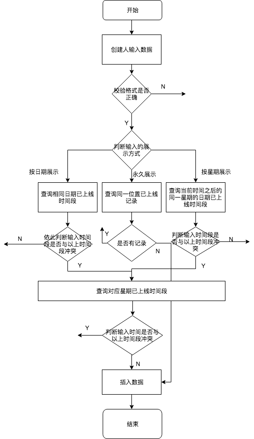

# 消息列表顶部区域支持配置

| 文档版本 | 作者 | 编写时间 | 更新日志 | 审核人 | 审核意见 | 分数 |
| ----- | ----- | ----- | ----- | ----- | ----- | ----- |
| v1.0 | 冯泽 | 2018-03-29 | 初稿 | -- | -- | -- |
          

## 一、需求 
[消息列表顶部区域支持配置](http://pm.jieniu.cc/projects/douyu_msg/wiki/2018-02-22_PRD-2)

## 三、业界调研(可选) 
不涉及

## 四、技术架构 

1.创建人输入展示方式、展示时间、位置等基本信息。 

2.日期\星期\时间等格式校验。 

3.判断输入的展示方式

永久展示： 
查询是否有同一位置已上线记录，如果有，不能插入；如果没有，可以插入。 

按日期时间展示： 
查询输入日期已上线记录时间段。依次判断输入的时间段是否与已上线时间段冲突。如果冲突，不能插入。否则，执行第4步。 

按星期时间展示： 
查询当前时间戳之后的所有同一星期已上线时间段。判断输入的时间段是否与同一星期已上线时间段冲突。如果冲突，不能插入。否则，执行第4步。 

4.查询输入的日期、星期，对应的星期已上线时间段。判断输入的时间段是否与对应星期已上线时间段冲突。如果冲突，不能插入。否则，可以插入。 

5.每分钟执行crontab，将满足时间条件的未上线活动上线，将已上线但到时间的活动下线。 



### 五、存储架构 
##### MySQL  

im_common数据库  
增加消息列表活动配置表（msg_list_act_conf）
消息列表活动配置表 `msg_list_act_conf`

```
CREATE TABLE `msg_list_act_conf` (
  `id` int(10) unsigned NOT NULL AUTO_INCREMENT,
  `target_user` tinyint(2) unsigned NOT NULL DEFAULT '1' COMMENT '目标用户 1 全局 2 车队',
  `title` varchar(20) COLLATE utf8mb4_unicode_ci NOT NULL DEFAULT '' COMMENT '标题',
  `icon` varchar(255) COLLATE utf8mb4_unicode_ci NOT NULL DEFAULT '' COMMENT '头像url',
  `url` varchar(255) COLLATE utf8mb4_unicode_ci NOT NULL DEFAULT '' COMMENT '跳转url',
  `position` tinyint(2) unsigned NOT NULL DEFAULT '1' COMMENT '位置 从左数',
  `action` tinyint(2) unsigned NOT NULL DEFAULT '1' COMMENT '跳转动作 1 打开webwiew 2 打开IM界面 3 跳转互动游戏界面 4 跳转鱼吧界面',
  `red_point` tinyint(2) unsigned NOT NULL DEFAULT '1' COMMENT '红点策略 1 关闭 2 每日出现 3 之出现一次',
  `display` tinyint(2) unsigned NOT NULL DEFAULT '1' COMMENT '展示方式 1 永久 2 按日期时间 3 按星期时间',
  `status` tinyint(1) unsigned NOT NULL DEFAULT '1' COMMENT '状态 1 未上线 2 已上线 3 已删除',
  `remarks` varchar(300) COLLATE utf8mb4_unicode_ci DEFAULT '' COMMENT '备注',
  `uid` int(10) unsigned NOT NULL DEFAULT '0' COMMENT '创建人ID',
  `created_at` timestamp NOT NULL DEFAULT CURRENT_TIMESTAMP COMMENT '创建时间',
  `updated_at` timestamp NOT NULL DEFAULT '0000-00-00 00:00:00' ON UPDATE CURRENT_TIMESTAMP COMMENT '修改时间',
  `start_date` int(10) DEFAULT NULL COMMENT '按日期时间展示 开始日期时间 时间戳',
  `end_date` int(10) DEFAULT NULL COMMENT '按日期时间展示 结束日期时间 时间戳',
  `start_time` char(5) COLLATE utf8mb4_unicode_ci DEFAULT NULL COMMENT '开始时间 00:00-23:59',
  `end_time` char(5) COLLATE utf8mb4_unicode_ci DEFAULT NULL COMMENT '结束时间 00:00-23:59',
  `weekend` varchar(13) COLLATE utf8mb4_unicode_ci DEFAULT NULL COMMENT '按星期时间展示 每星期几 1,2,3,4,5,6,7',
  PRIMARY KEY (`id`)
) ENGINE=InnoDB DEFAULT CHARSET=utf8mb4 COLLATE=utf8mb4_unicode_ci COMMENT='消息列表活动配置表'
```


##### Redis  

| 键名 | 类型 | 存储说明 | 备注 | 缓存时间 | 预计占用空间 |
| ------|-------:| -----:| -----:| -----:| ----: |


    
##### 其他存储
不涉及

### 六、接口描述 
不涉及

### 七、性能评估 
| 接口名 | 目前线上 QPS | 预计达到 QPS | 可能性能瓶颈点 |
| ------|------| -----| -----|
不涉及
 
### 八、版本兼容 
不涉及

### 九、其他 
不涉及


